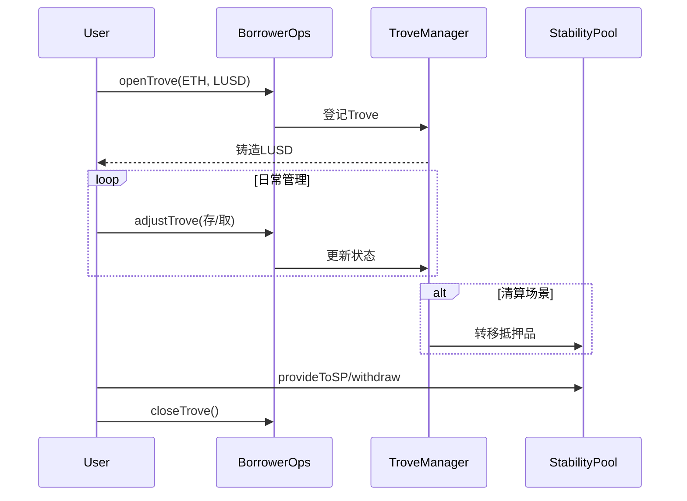
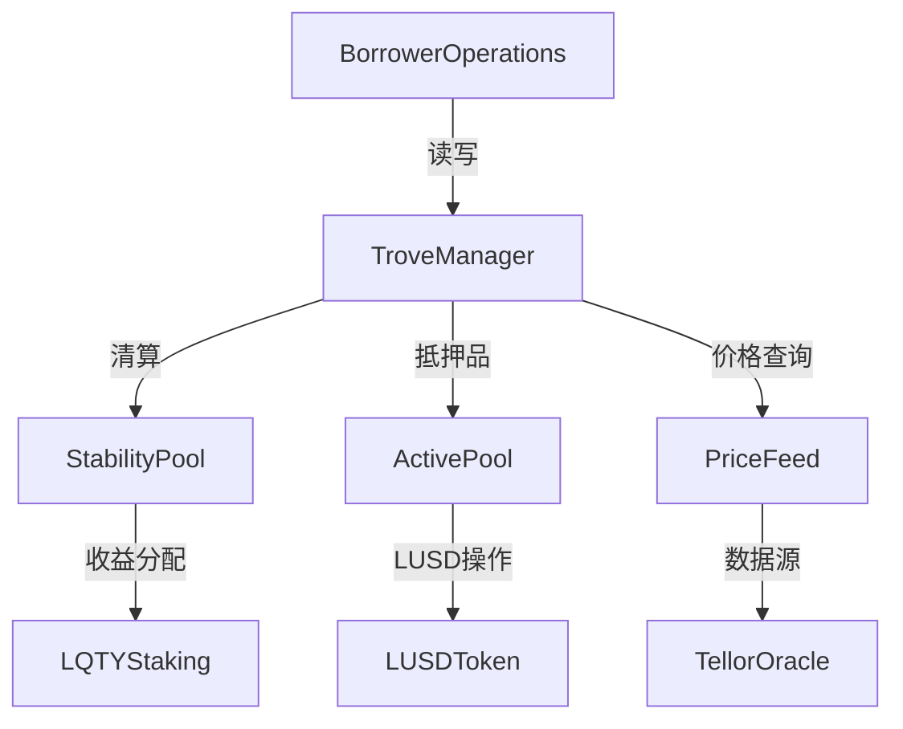

```mermaid
sequenceDiagram
    participant User
    participant BorrowerOps
    participant TroveManager
    participant StabilityPool

    User->>BorrowerOps: openTrove(ETH, LUSD)
    BorrowerOps->>TroveManager: 登记Trove
    TroveManager-->>User: 铸造LUSD
    loop 日常管理
        User->>BorrowerOps: adjustTrove(存/取)
        BorrowerOps->>TroveManager: 更新状态
    end
    alt 清算场景
        TroveManager->>StabilityPool: 转移抵押品
    end
    User->>StabilityPool: provideToSP/withdraw
    User->>BorrowerOps: closeTrove()
```

```mermaid
graph TD
    A[BorrowerOperations] -->|读写| B[TroveManager]
    B -->|清算| C[StabilityPool]
    B -->|抵押品| D[ActivePool]
    D -->|LUSD操作| E[LUSDToken]
    B -->|价格查询| F[PriceFeed]
    F -->|数据源| G[TellorOracle]
    C -->|收益分配| H[LQTYStaking]
```