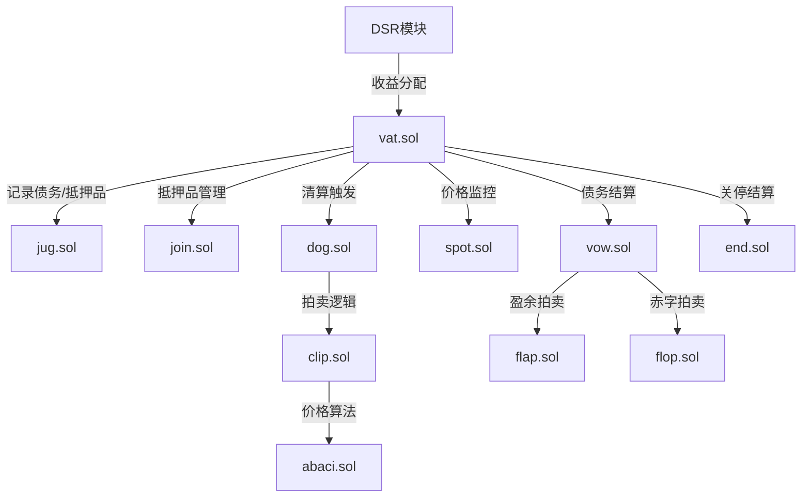
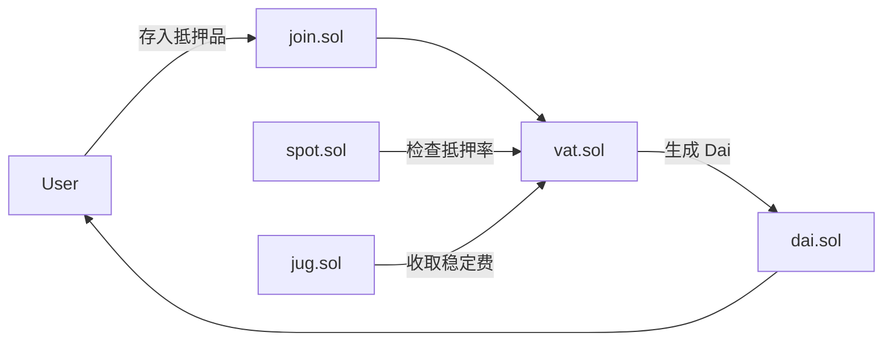
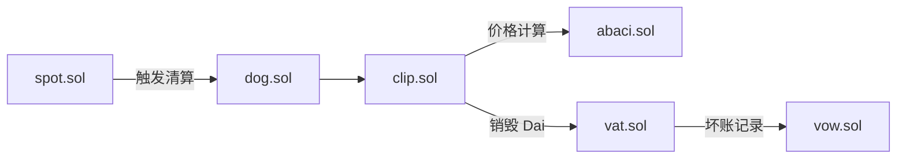
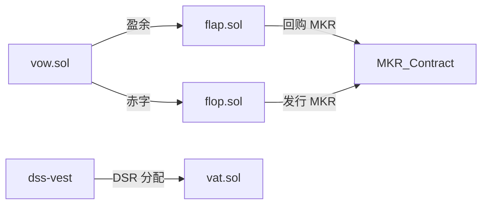
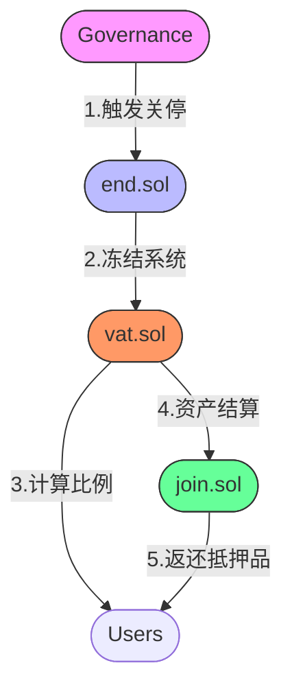
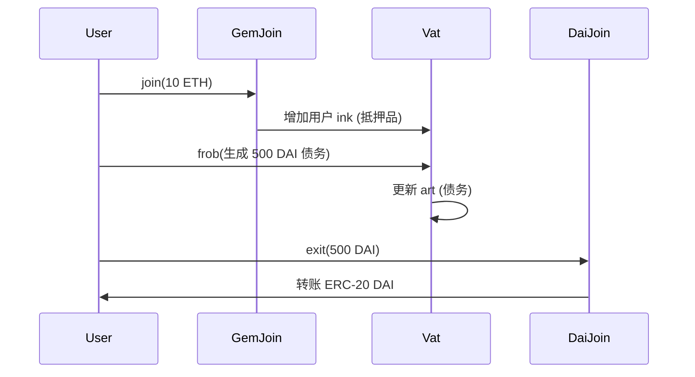

## 1. 核心合约文件概览

文件名	主要作用	当前状态（2023）  
​vat.sol​	核心会计系统，跟踪所有债务（Dai）和抵押品（如 ETH）。	✅ 使用中  
​dai.sol​	Dai 稳定币的 ERC20 合约，处理 Dai 的转账和授权。	✅ 使用中  
​join.sol​	抵押品进出系统的入口/出口（如 ETH → WETH 的包装和解包）。	✅ 使用中  
​jug.sol​	计算并收取稳定费（借贷利率），调整 Dai 的债务总量。	✅ 使用中  
​spot.sol​	实时监控抵押品价格，触发清算阈值判断。	✅ 使用中  
​dog.sol​	清算模块，管理抵押品拍卖的触发和参数（如罚金比例）。	✅ 使用中  
​clip.sol​	抵押品拍卖合约，实现荷兰式拍卖（价格递减）逻辑。	✅ 使用中  
​abaci.sol​	提供价格递减算法（线性/指数），供 clip.sol 使用。	✅ 使用中  
​end.sol​	系统关闭（紧急关停）模块，冻结协议并处理剩余资产。	✅ 使用中  
​vow.sol​	管理系统盈余（利润）和赤字（坏账），触发债务拍卖（flop/flap）。	✅ 使用中  
​flap.sol​	盈余拍卖（用盈余 Dai 回购 MKR 并销毁）。	✅ 使用中  
​flop.sol​	赤字拍卖（发行 MKR 出售以填补坏账）。	✅ 使用中  
sdai.sol​	储蓄利率模块（Dai 存款的 DSR 收益）。	✅ 使用中 
​pot.sol​	储蓄利率模块（Dai 存款的 DSR 收益）。	❌ 已弃用（由 dss-vest 替代）  
​cure.sol​	辅助模块，处理系统债务的结算和修复（如坏账回收）。	❌ 已弃用  
​cat.sol​	旧版清算模块（已由 dog.sol 替代）。	❌ 已弃用  
​flip.sol​	旧版抵押品拍卖合约（已由 clip.sol 替代）。	❌ 已弃用  

## 2. 核心交互流程

(1) 用户生成 Dai（借贷）​​  
​存入抵押品​  
用户调用 join.sol 将 ETH 转为 WETH 并存入 vat.sol。  
vat.sol 记录抵押品余额（gem）和用户债务（dai）。  
​计算债务上限​  
spot.sol 根据预言机价格计算抵押率（如 150% ETH 抵押生成 Dai）。  
​生成 Dai​  
用户调用 vat.sol 的 frob 函数生成 Dai，同时 jug.sol 开始累计稳定费（利息）。  
生成的 Dai 通过 dai.sol 转账给用户。  
​​(2) 清算流程（抵押品不足时）​​  
​价格监控​  
spot.sol 检测抵押品价值低于清算阈值（如 110%）。  
​触发清算​  
dog.sol 调用 clip.sol 启动拍卖，使用 abaci.sol 的价格递减算法（如指数下降）。  
​拍卖结算​  
竞拍者通过 clip.sol 购买抵押品，支付 Dai 销毁债务。  
若拍卖未完全覆盖债务，剩余坏账由 vow.sol 处理。  
​​(3) 系统盈余与赤字管理​  
​盈余处理​  
清算罚金和稳定费收入存入 vow.sol 的 surplus。  
通过 flap.sol 拍卖（用盈余 Dai 回购 MKR 并销毁）。  
​赤字处理​  
若债务无法通过清算覆盖，vow.sol 触发 flop.sol 拍卖（发行 MKR 出售以填补赤字）。  
​​(4) 系统关停（紧急情况）​​  
​触发关停​  
治理调用 end.sol 冻结协议，停止所有借贷和清算。  
​资产结算​  
用户按比例取回抵押品，Dai 持有者按最终资产比例兑换。  

## 3. 合约关联关系

​(1) 借贷流程  

​(2) 清算流程  

​(3) 系统经济平衡  

​(4) 紧急关停  

​**vat.sol 是核心枢纽**​：所有模块通过它读写债务和抵押品状态。  
​清算链条​：spot.sol → dog.sol → clip.sol（依赖 abaci.sol）。  
​经济平衡​：jug.sol（稳定费）、vow.sol（坏账）、flap/flop.sol（拍卖）共同维护 Dai 的稳定性。  

## 4. 已弃用合约

合约	替代合约	弃用原因  
​cat.sol​	dog.sol	新版清算模块更高效  
​flip.sol​	clip.sol	新版拍卖机制更灵活  
​pot.sol​	dss-vest	储蓄利率模块升级  
​cure.sol​	-	功能整合进 vow.sol  

## 5. 总结​
​当前使用中的核心模块​：vat.sol、dai.sol、join.sol、jug.sol、spot.sol、dog.sol、clip.sol、abaci.sol、vow.sol、flap.sol、flop.sol、end.sol。  
​已弃用模块​：cat.sol、flip.sol、pot.sol、cure.sol（由更高效的版本替代）。  
​交互流程​：抵押品存入 → Dai 生成 → 清算/拍卖 → 盈余/赤字管理 → 紧急关停（可选）。  
MakerDAO 的 DSS 系统通过模块化设计实现了去中心化稳定币的高效运行，同时不断优化合约以提高安全性和效率。 

